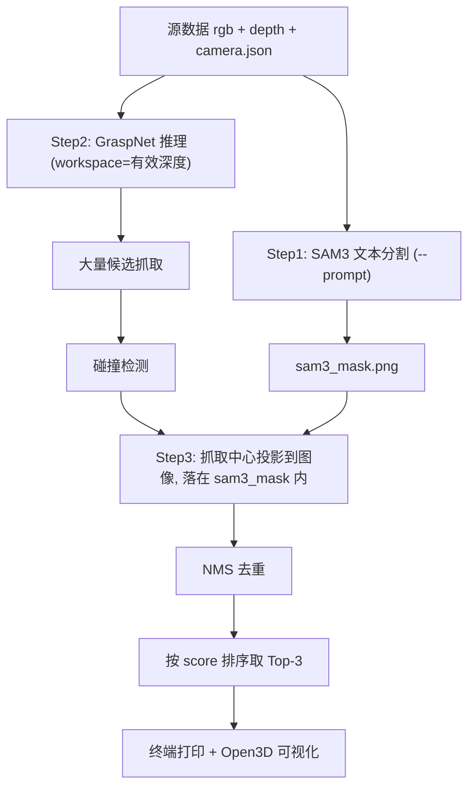

ref:
https://github.com/graspnet/graspnet-baseline

## 安装环境（sam3 / Python 3.12）

```bash
conda activate sam3

# open3d 需走官方源（阿里云镜像无 py3.12 wheel）
pip install open3d -i https://pypi.org/simple/

# graspnetAPI：原 setup.py 锁定 numpy==1.23.4，与 Python 3.12 不兼容，已改为 numpy>=1.23.4
cd graspnetAPI
pip install . --no-deps
pip install transforms3d trimesh grasp_nms cvxopt dill h5py pywavefront scikit-image matplotlib autolab_core autolab-perception

# sam3 要求 numpy<2，装完上述包后若被升级需 pin 回来
pip install "numpy>=1.26,<2"
```

验证：

```bash
python -c "from graspnetAPI import GraspGroup; print('OK')"
```

## 目录结构

```
graspnet-baseline/
├── demo.py                      # GraspNet 推理入口
├── command_demo.sh              # 官方 example_data demo
├── command_demo_custom.sh       # 自定义数据 + SAM3 流水线
├── doc/
│   ├── example_data/            # 官方示例（color/depth/meta/workspace_mask）
│   ├── dryer/ pot/ real_fan/    # 自定义源数据（只放最少文件）
│   ├── prepare_demo_data.py     # 源数据 → demo 格式
│   ├── run_seg_grasp_demo.py    # SAM3（可选）+ 准备数据 + 推理
│   └── sam3_seg.py              # SAM3 HTTP 客户端
└── output/                      # 每次推理的中间结果（gitignore）
    └── <timestamp>_<dataset>/
```

## 自定义源数据格式

`doc/dryer`、`doc/pot`、`doc/real_fan` 等目录**只保留原始输入**，不要在源目录里写推理产物：

| 文件 | 说明 |
|------|------|
| `rgb.png` | RGB 彩色图 |
| `depth.npy` 或 `depth_raw.png` | 深度（float 米制或 uint16 mm） |
| `camera.json` | 内参 `cam_K` + `depth_scale` |

## 推理流程

### 1. 官方 example demo

```bash
cd graspnet-baseline
bash command_demo.sh
```

### 2. 自定义数据（推荐：SAM3 分割 + GraspNet）

每次运行会把中间文件写到 `output/<时间戳>_<数据集>/`，**不会污染** `doc/dryer` 等源目录。

```bash
cd graspnet-baseline

# 使用 SAM3 文本提示分割目标，再推理（需 SAM3 服务 http://127.0.0.1:18002/infer）
CUDA_VISIBLE_DEVICES=0 python doc/run_seg_grasp_demo.py \
  --data_dir doc/real_fan \
  --prompt 'hair dryer' \
  --checkpoint_path /path/to/checkpoint-rs.tar

# 不用 SAM3，在整幅有效深度上推理（--prompt 可省略）
CUDA_VISIBLE_DEVICES=0 python doc/run_seg_grasp_demo.py \
  --data_dir doc/real_fan \
  --checkpoint_path /path/to/checkpoint-rs.tar
```

也可直接：`bash command_demo_custom.sh`

### 3. 分步执行

```bash
# Step 1: 准备 demo 格式（可选 SAM3）
python doc/prepare_demo_data.py doc/real_fan \
  --output_dir output/manual_real_fan \
  --prompt 'hair dryer'

# Step 2: GraspNet 推理
python demo.py \
  --checkpoint_path /path/to/checkpoint-rs.tar \
  --data_dir output/manual_real_fan \
  --top_k 3
```

## SAM3 分割 + mask 内取 Top-3（本仓库改动）

相对官方 `demo.py` 仅在工作空间内推理并展示 Top-50，本仓库对**自定义数据流水线**做了如下调整：

### 与旧方案对比

| | 旧方案（曾用过） | **当前方案** |
|---|----------------|-------------|
| SAM3 mask 用途 | 与有效深度求交 → 作为 `workspace_mask` 输入 GraspNet | **仅保存为 `sam3_mask.png`，不参与 GraspNet 输入** |
| GraspNet 输入范围 | 仅 SAM3 分割区域内点云 | **整幅有效深度**（与官方 demo 思路一致，视野更全） |
| 抓取筛选 | 直接 NMS + Top-K | **先按 SAM3 mask 过滤抓取中心 → NMS → Top-3** |
| 默认展示数量 | Top-50 | **Top-3** |

设计意图：GraspNet 在全场景点云上预测，再用 SAM3 文本指定**目标物体**，只保留落在该物体分割区域内的抓取。

### 三步流水线



1. **SAM3 分割**（`doc/prepare_demo_data.py`，需 `--prompt`）
   - 调用 SAM3 HTTP 服务（默认 `http://127.0.0.1:18002/infer`）
   - 提示词示例：`dryer`、`pot`、`hair dryer`
   - 输出：`sam3_mask.png`（bool 目标区域）、`sam3_results/`（可视化与 json）

2. **GraspNet 推理**（`demo.py`，与官方一致）
   - `workspace_mask.png` = 有效深度区域（**不含** SAM3 约束）
   - 网络在全工作空间点云上预测抓取 → 碰撞检测

3. **mask 内取 Top-3**（`demo.py` → `filter_grasps_in_sam3_mask`）
   - 将每条抓取的 **center (x,y,z)** 用相机内参投影到像素 `(u,v)`
   - 若 `sam3_mask[v,u]==True` 则保留
   - 对保留结果做 **NMS** → **按 score 降序** → 取 **`--top_k`（默认 3）**
   - 终端打印 Top-3；Open3D 只画这 3 个夹爪

无 `--prompt` 时不生成 `sam3_mask.png`，跳过 Step3 的 mask 过滤，行为等同普通 demo（仍取 Top-3 展示）。

### 相关代码

| 文件 | 作用 |
|------|------|
| `doc/sam3_seg.py` | SAM3 HTTP 客户端、mask 解码 |
| `doc/prepare_demo_data.py` | Step1：SAM3 + 写 `sam3_mask.png` / demo 格式 |
| `doc/run_seg_grasp_demo.py` | 一键：prepare → demo，输出到 `output/<timestamp>_<dataset>/` |
| `demo.py` | Step2+3：推理、mask 过滤、`filter_grasps_in_sam3_mask`、Top-K 展示 |

### 投影过滤逻辑（简述）

抓取中心在相机坐标系下为 `(x,y,z)`（米），内参 `fx,fy,cx,cy`：

```
u = fx * x / z + cx
v = fy * y / z + cy
```

若 `0 ≤ u < W`、`0 ≤ v < H` 且 `sam3_mask[v,u]` 为真，则该抓取属于目标物体区域。

## 推理流程（自定义数据）

1. **SAM3**：按 `--prompt` 分割目标 → 保存 `sam3_mask.png`
2. **GraspNet**：在整幅有效深度上推理（`workspace_mask` = 有效深度，不限于 SAM3 区域）
3. **后过滤**：只保留抓取中心落在 `sam3_mask` 内的结果 → NMS → 取 **Top-3**

## 每次推理输出（`output/<timestamp>_<dataset>/`）

| 文件 | 说明 |
|------|------|
| `run_manifest.json` | 记录 source_dir、prompt 等 |
| `color.png` / `depth.png` | 转换后的 demo 输入 |
| `workspace_mask.png` | 有效深度区域（GraspNet 输入） |
| `sam3_mask.png` | SAM3 目标分割（抓取后过滤用） |
| `meta.mat` | 相机内参 + factor_depth |
| `sam3_results/` | SAM3 分割详情（使用 `--prompt` 时） |

终端打印 **Top-3 抓取**（在 sam3_mask 内），`[0]` 为最优；Open3D 展示 Top-3 夹爪。

## 抓取结果解读

### 终端输出示例

```
-> grasps inside sam3_mask: 29/213
-> top 3 grasps (score, width, depth, center):
   [ 0] score=1.6577 width=0.0852 depth=0.0200 center=(0.079, 0.031, 0.278)
   [ 1] score=1.4478 width=0.0863 depth=0.0200 center=(0.068, 0.032, 0.279)
   [ 2] score=0.9553 width=0.0670 depth=0.0200 center=(0.067, 0.020, 0.279)
```

| 行 | 含义 |
|----|------|
| `29/213` | 碰撞检测后 213 个候选；其中抓取中心落在 SAM3 mask 内的 29 个；再 NMS 取 Top-3 |
| `score` | 抓取质量分（含 tolerance 加权，**不是 0~1 概率**，可大于 1） |
| `width` | 夹爪开口宽度（米） |
| `depth` | 沿接近方向插入深度（米），如 0.02 = 2 cm |
| `center` | 抓取中心在**相机坐标系**下的 (x, y, z)（米） |

**执行建议**：优先使用 `[0]`；`[1]`、`[2]` 为备选。

### 是 7 自由度吗？

终端只打印摘要；GraspNet / graspnetAPI 里一条抓取实际是 **17 维**：

```
[ score, width, height, depth,  R(9),  t(3),  object_id ]
```

| 自由度 | GraspNet 表示 | 终端是否打印 |
|--------|---------------|--------------|
| 位置 x, y, z | `translation` / `center` | 是 |
| 姿态（3 DOF） | `rotation_matrix`（3×3） | 否 |
| 夹爪开口 | `width` | 是 |
| 插入深度 | `depth` | 是 |
| 指高 | `height`（demo 固定 0.02 m） | 否 |

若按「**6D 位姿 + 夹爪开口 = 7 参数**」理解，还缺 **`rotation_matrix`（旋转 3 自由度）**；GraspNet 另有 **`depth`**（插入深度），比常说的 7-DOF 多一维夹爪参数。

旋转由两部分合成 3×3 矩阵（非 roll/pitch/yaw 直接输出）：

1. **approach 方向**：Stage1 从 300 个候选接近方向中选一个  
2. **in-plane angle**：绕接近轴旋转，12 个离散角度中选一个  

### 坐标系

`center=(x, y, z)` 为**相机坐标系**（与 depth 反投影一致）：

- x：右  
- y：下  
- z：前（深度，单位米）  

发给机械臂前，需通过**手眼标定**变换到 base / tool 坐标系。

### 查看完整位姿（含旋转）

```python
from graspnetAPI import GraspGroup
import numpy as np

g = gg[0]  # Top-1
print("translation:", g.translation)
print("rotation:\n", g.rotation_matrix)
print("width:", g.width, "depth:", g.depth, "height:", g.height)

# 4×4 齐次变换
T = np.eye(4)
T[:3, :3] = g.rotation_matrix
T[:3, 3] = g.translation
```

### score 为何能大于 1？

解码时：`score = grasp_score × tolerance / GRASP_MAX_TOLERANCE`，是质量与鲁棒性的加权，不是概率。

## 常用参数

| 参数 | 默认 | 说明 |
|------|------|------|
| `--prompt` | 无 | SAM3 文本提示；有则分割并启用 mask 内 Top-K 过滤 |
| `--top_k` | 3 | SAM3 mask 内、NMS 后展示/打印的抓取数 |
| `--threshold` | 0.41 | SAM3 检测阈值（prepare 阶段） |
| `--mask_threshold` | 0.50 | SAM3 mask 阈值（prepare 阶段） |
| `--collision_thresh` | 0.01 | 碰撞检测阈值，`-1` 跳过 |
| `--output_root` | `output/` | 时间戳输出根目录 |

## 说明

- **`workspace_mask.png`**：有效深度，供 GraspNet **输入**点云采样。  
- **`sam3_mask.png`**：SAM3 目标分割，供 GraspNet **输出**抓取的后过滤；二者职责分离。  
- 推理流程详见 [infer.md](infer.md)。  
- `output/` 已加入 `.gitignore`；旧路径 `doc/output/` 如存在可手动删除。
