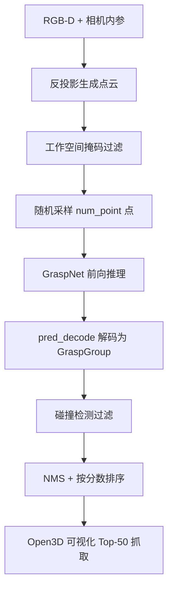
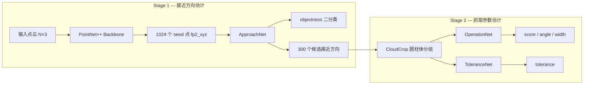

# GraspNet 推理流程说明

以 `graspnet-baseline/demo.py` 为入口，梳理一次完整抓取推理从输入到可视化的全过程。

## 快速运行

```bash
conda activate sam3
cd graspnet-baseline
bash command_demo.sh
# 等价于：
# CUDA_VISIBLE_DEVICES=0 python demo.py --checkpoint_path /path/to/checkpoint-rs.tar
```

`demo.py` 主流程只有四步：

```python
def demo(data_dir):
    net = get_net()                              # 1. 加载模型
    end_points, cloud = get_and_process_data(data_dir)  # 2. 预处理
    gg = get_grasps(net, end_points)             # 3. 网络推理 + 解码
    if cfgs.collision_thresh > 0:
        gg = collision_detection(gg, np.array(cloud.points))  # 4. 碰撞过滤
    vis_grasps(gg, cloud)                        # 5. NMS + 可视化
```

默认读取 `doc/example_data/`，需要以下文件：

| 文件 | 含义 |
|------|------|
| `color.png` | RGB 图像 |
| `depth.png` | 深度图（uint16） |
| `workspace_mask.png` | 工作空间掩码 |
| `meta.mat` | 相机内参 `intrinsic_matrix` 与深度缩放 `factor_depth` |

---

## 整体流程



---

## Step 1：加载模型 — `get_net()`

```36:49:graspnet-baseline/demo.py
def get_net():
    # Init the model
    net = GraspNet(input_feature_dim=0, num_view=cfgs.num_view, num_angle=12, num_depth=4,
            cylinder_radius=0.05, hmin=-0.02, hmax_list=[0.01,0.02,0.03,0.04], is_training=False)
    device = torch.device("cuda:0" if torch.cuda.is_available() else "cpu")
    net.to(device)
    # Load checkpoint
    checkpoint = torch.load(cfgs.checkpoint_path)
    net.load_state_dict(checkpoint['model_state_dict'])
    ...
    net.eval()
    return net
```

要点：

- 构建 `GraspNet` 模型，`is_training=False` 表示推理模式（Stage2 不再依赖 GT 标签）。
- 从 checkpoint 恢复 `model_state_dict`。
- 关键超参：
  - `num_view=300`：每个 seed 点候选的接近方向数
  - `num_angle=12`：夹爪在平面内旋转的离散类别数（每类间隔 π/12）
  - `num_depth=4`：夹爪插入深度的离散类别数（对应 1~4 cm）

---

## Step 2：数据预处理 — `get_and_process_data()`

### 2.1 深度图 → 点云

```51:67:graspnet-baseline/demo.py
def get_and_process_data(data_dir):
    color = np.array(Image.open(..., 'color.png')), dtype=np.float32) / 255.0
    depth = np.array(Image.open(..., 'depth.png')))
    workspace_mask = np.array(Image.open(..., 'workspace_mask.png')))
    meta = scio.loadmat(..., 'meta.mat')
    intrinsic = meta['intrinsic_matrix']
    factor_depth = meta['factor_depth']

    camera = CameraInfo(1280.0, 720.0, intrinsic[0][0], intrinsic[1][1], intrinsic[0][2], intrinsic[1][2], factor_depth)
    cloud = create_point_cloud_from_depth_image(depth, camera, organized=True)
    mask = (workspace_mask & (depth > 0))
    cloud_masked = cloud[mask]
```

`create_point_cloud_from_depth_image` 用针孔相机模型反投影：

```
x = (u - cx) * z / fx
y = (v - cy) * z / fy
z = depth / scale
```

只保留 `workspace_mask` 内且深度有效的点。

### 2.2 随机下采样

网络固定输入 `num_point`（默认 20000）个点。有效点足够则无放回采样，不足则有放回补齐。

### 2.3 构造网络输入

```python
end_points['point_clouds'] = cloud_sampled  # shape: (1, N, 3)，送入 GPU
end_points['cloud_colors'] = color_sampled  # 仅用于可视化，不参与推理
```

同时构建完整点云 `cloud`（Open3D 格式），供后续碰撞检测和可视化使用。

---

## Step 3：网络推理 — `get_grasps()`

```92:99:graspnet-baseline/demo.py
def get_grasps(net, end_points):
    with torch.no_grad():
        end_points = net(end_points)
        grasp_preds = pred_decode(end_points)
    gg_array = grasp_preds[0].detach().cpu().numpy()
    gg = GraspGroup(gg_array)
    return gg
```

`GraspNet` 是两阶段结构：



### Stage 1：View Estimation

文件：`models/graspnet.py` → `GraspNetStage1`

1. **PointNet++ Backbone**（`models/backbone.py`）
   - 4 层 Set Abstraction：2048 → 1024 → 512 → 256 点
   - 2 层 Feature Propagation：上采样回 1024 个 seed 点
   - 输出 `fp2_xyz`（seed 坐标）和 `fp2_features`（seed 特征）

2. **ApproachNet**（`models/modules.py`）
   - 对每个 seed 点预测：
     - `objectness_score`：该点是否在物体上（2 类）
     - `view_score`：300 个预定义接近方向的得分
   - 取得分最高的方向作为 `grasp_top_view_xyz` / `grasp_top_view_rot`

### Stage 2：Grasp Configuration

文件：`models/graspnet.py` → `GraspNetStage2`

1. **CloudCrop**
   - 以 seed 点为轴心、接近方向为轴，在圆柱体内裁剪局部点云
   - 4 个不同深度层（hmax: 1/2/3/4 cm），每层采样 64 个点
   - 经 MLP + max pooling 得到 `vp_features`

2. **OperationNet**
   - 预测每个 (seed, depth) 上的：
     - `grasp_score_pred`：12 个角度类别的抓取质量分数
     - `grasp_angle_cls_pred`：12 个角度类别 logits
     - `grasp_width_pred`：12 个角度对应的夹爪宽度

3. **ToleranceNet**
   - 预测 `grasp_tolerance_pred`：抓取容错/鲁棒性，用于修正最终分数

### pred_decode：张量 → 抓取姿态

文件：`models/graspnet.py` → `pred_decode()`

解码逻辑（对每个 seed 点）：

| 步骤 | 操作 |
|------|------|
| 选角度 | `argmax(grasp_angle_cls_pred)` → 平面旋转角 = class / 12 × π |
| 选深度 | 在选中角度下 `argmax(grasp_score_pred)` → depth = (class+1) × 0.01 m |
| 过滤背景 | 只保留 `objectness == 1` 的 seed 点 |
| 算最终分 | `score × tolerance / GRASP_MAX_TOLERANCE` |
| 组装姿态 | 接近方向 + 旋转角 → 3×3 旋转矩阵；seed 坐标 → 抓取中心 |

每条抓取输出 17 维向量，封装为 `graspnetAPI.GraspGroup`：

```
[score, width, height, depth, R(9), center(3), object_id]
```

---

## Step 4：碰撞检测 — `collision_detection()`

```101:105:graspnet-baseline/demo.py
def collision_detection(gg, cloud):
    mfcdetector = ModelFreeCollisionDetector(cloud, voxel_size=cfgs.voxel_size)
    collision_mask = mfcdetector.detect(gg, approach_dist=0.05, collision_thresh=cfgs.collision_thresh)
    gg = gg[~collision_mask]
    return gg
```

`ModelFreeCollisionDetector`（`utils/collision_detector.py`）是无模型碰撞检测：

1. 场景点云体素下采样（默认 voxel_size=0.01 m）
2. 对每个抓取姿态，将场景点变换到夹爪坐标系
3. 检查左指、右指、底部、接近路径四个区域是否与场景点重叠
4. 重叠体积比超过 `collision_thresh`（默认 0.01）则判定为碰撞，剔除

设 `--collision_thresh -1` 可跳过此步（测试脚本中的快速推理模式）。

---

## Step 5：后处理与可视化 — `vis_grasps()`

```107:112:graspnet-baseline/demo.py
def vis_grasps(gg, cloud):
    gg.nms()
    gg.sort_by_score()
    gg = gg[:50]
    grippers = gg.to_open3d_geometry_list()
    o3d.visualization.draw_geometries([cloud, *grippers])
```

1. **NMS**：非极大值抑制，去除空间上过于接近的重复抓取
2. **按分数排序**，取 Top-50
3. 通过 `graspnetAPI` 将抓取转为 Open3D 夹爪几何体，与场景点云一起显示

---

## 关键命令行参数

| 参数 | 默认值 | 说明 |
|------|--------|------|
| `--checkpoint_path` | 必填 | 预训练权重路径 |
| `--num_point` | 20000 | 输入网络的采样点数 |
| `--num_view` | 300 | 接近方向候选数 |
| `--collision_thresh` | 0.01 | 碰撞 IoU 阈值，-1 跳过 |
| `--voxel_size` | 0.01 | 碰撞检测前点云体素大小 |

---

## 与 test.py 的区别

| | `demo.py` | `test.py` |
|---|-----------|-----------|
| 输入 | 单帧 RGB-D 文件 | GraspNet-1B 完整测试集 |
| 输出 | Open3D 交互可视化 | 抓取结果 dump 到磁盘 |
| 评估 | 无 | 调用 graspnetAPI 计算 AP |
| 碰撞检测 | 默认开启 | 可设 `-1` 加速 |

`demo.py` 适合快速验证单帧推理效果；批量评测和指标计算走 `test.py`。

---

## 依赖关系

```
demo.py
├── models/graspnet.py          # GraspNet 模型 + pred_decode
├── models/backbone.py          # PointNet++ 特征提取
├── models/modules.py           # ApproachNet / CloudCrop / OperationNet / ToleranceNet
├── pointnet2/                  # CUDA 点云算子（需编译安装）
├── utils/data_utils.py         # 深度图 → 点云
├── utils/collision_detector.py # 无模型碰撞检测
└── graspnetAPI                 # GraspGroup 数据结构 + 可视化
```
